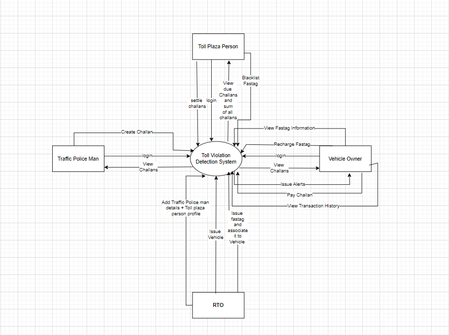
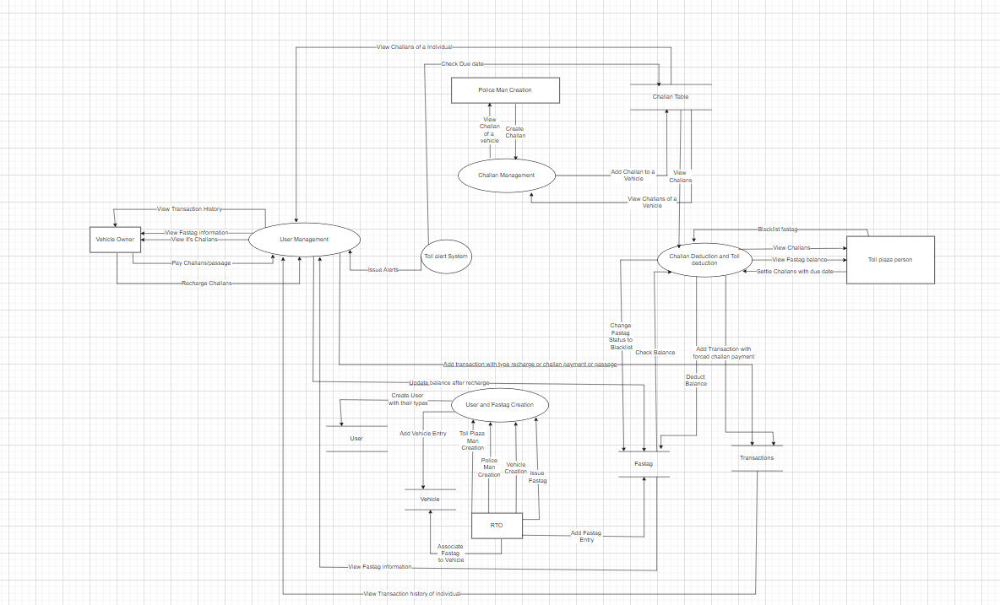
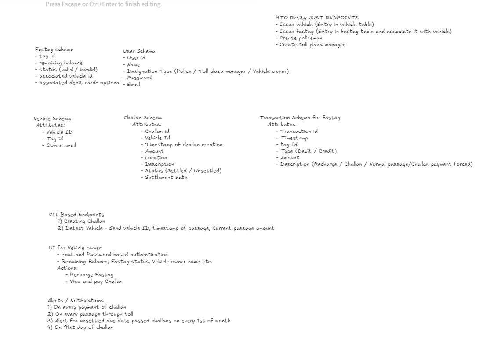

# **Project Overview**
The Toll Violation Detection System is designed to detect vehicles crossing toll plazas with unsettled tickets or challans from the National Highways Authority of India (NHAI) that are older than 90 days. The system automatically alerts vehicle owners and deducts overdue amounts from their FASTTAG wallets. This project utilizes various Azure services, making it straightforward to implement, especially for interns.
# **Objective**
Develop a system to monitor vehicle crossings at toll plazas.
Automatically manage outstanding toll payments and notify vehicle owners.
# **Components and Technologies**
Azure Cosmos DB: Stores vehicle data, transaction history, and wallet balances.
Azure Functions: Processes vehicle crossings, checks for unresolved NHAI challans, sends alerts, and manages FASTTAG wallet deductions.
Azure Secret Vault: Securely stores sensitive credentials such as API keys and database connection strings.
Terraform: Automates the deployment of Azure resources for consistent infrastructure management.
Azure Blob Storage: Stores processed reports and logs for compliance and auditing.

Initialised project with directory structure- currently on master branch

Resource group name = Toll-Violation-Detection-System
DB Account = Toll-Violation-Detection-System-DB-Account
DB Name = Toll-Violation-Detection-System-DB

Table Names = [Challan-Table, User-Table, Vehicle-Table, Fastag-Table, Transaction-Table]
Id's = [id,id,id,id,id]
Partition keys = [vehicleId, email, email, vehicleId, tagId]
